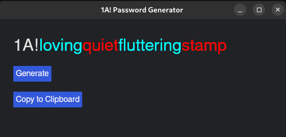

# 1A! Password Generator

A simple desktop application to generate secure random passwords and copy them to the clipboard. Built with Rust and the Iced GUI library. Compiles to Web Assembly.



## Features
- Generates passwords consisting of a prefix ("1A!") followed by 4 easy to remember words
- Satisfy the typical standards of passwords: uppercase, symbol, digit. While still being easy to remember.
- Very strong passsword. Would take ~90 centuries to brute force
- Uses Dark theme colors by default

## Table of Contents

- [Installation](#installation)
- [Usage](#usage)


## Installation

```
git clone https://github.com/renand3z/password-generator
cd password-generator
cargo run
```

## Usage

Generate a random password with a click. Copy it directly to the clipboard for easy pasting.


